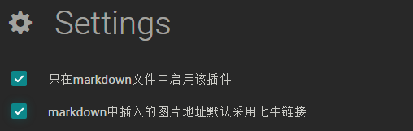

insert-img package
==============================================================

##### This [Atom package](https://atom.io/packages/insert-img) helps you insert images easily from clipboard, save the image into file and upload the image to qiniu cloud.

### Install

You can choose any of the following ways to install this package. You'd better reload your Atom after installation.

  - Open Atom, click File -> Setting -> Install -> Search`insert-img`
  - Open Cmd(Windowns) or Terminal(Mac/Linux): `apm install insert-img`
  - Download the source codes from [Github](https://github.com/Cubernet/insert-img) and install locally.

### How to use

  1. Installation.
  2. You can insert images from clipboard into markdown file using `ctrl+alt+v` with default setting.

### Setting

  1. Choose whether enable this package only in markdown file.

  

  2. If you have a qiniu `bucket`, after input the `七牛-AK` `七牛-Bucket` `七牛-Domain` and `七牛-SK`, you can also insert the qiniu-linked-image.  

  

### Credits

Special thanks to ...

-	[Atom](https://atom.io/) for this wonderful editor!
-	[amWiki](https://atom.io/packages/amWiki) - A lightweight  wiki library system based on atom.
